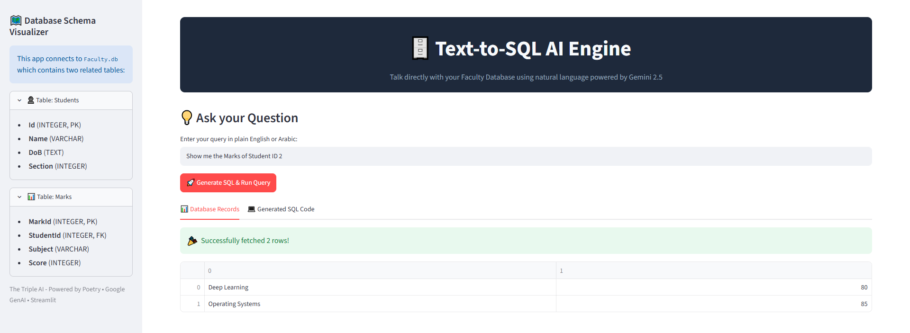

# 🗄️ Text-to-SQL AI Engine (Multi-Table Faculty Database)

An advanced GenAI-powered application that translates natural language questions (English/Arabic) into executable SQL queries, runs them against a relational SQLite database, and visualizes the results instantly. Powered by the latest **Google GenAI SDK (Gemini 2.5 Flash)** and **Streamlit**.

---

## 📸 Application Preview

Below is a live preview of the application dashboard, showing the live schema visualizer, interactive database preview, and the generated SQL results.



---

## ✨ Key Features

- **Natural Language to SQL:** Seamlessly converts complex user questions into optimized SQL commands.
- **Multi-Table Relational Schema:** Supports advanced database structures with `FOREIGN KEY` constraints and cross-table `JOIN` operations.
- **Live Database Preview:** Displays real-time interactive previews of the database tables (`Students` & `Marks`) using Pandas DataFrames right inside the UI.
- **Production-Ready UI/UX:** Built with a modern dark-themed interface, using separate structural tabs for *Database Records* and *Generated SQL Code*.
- **Robust Prompt Engineering:** Implements strict guardrails to prevent LLM hallucinations regarding column and table naming mismatches.

---

## 🏗️ System Architecture & Workflow

1. **User Input:** User type a question in plain text (e.g., *"Give me the marks of Ahmed Akram in Machine Learning"*).
2. **LLM Translation:** Gemini 2.5 Flash parses the question along with the injected database schema context and structural constraints.
3. **SQL Generation:** The AI agent outputs a raw, valid SQL query string.
4. **Database Execution:** The Python backend securely executes the query on the local `Faculty.db` (SQLite3).
5. **UI Rendering:** Streamlit fetches the raw tuples, wraps them into a DataFrame, and populates the reactive dashboard.

---

## 🗄️ Database Schema Blueprint

The application connects to a localized `Faculty.db` structured as follows:

### 1. `Students` Table (Primary)
| Column Name | Data Type | Attributes |
| :--- | :--- | :--- |
| `Id` | INTEGER | PRIMARY KEY, AUTOINCREMENT |
| `Name` | VARCHAR(25) | UNIQUE, NOT NULL |
| `DoB` | TEXT | Date of Birth |
| `Section` | INTEGER | Class Section Number |

### 2. `Marks` Table (Secondary)
| Column Name | Data Type | Attributes |
| :--- | :--- | :--- |
| `MarkId` | INTEGER | PRIMARY KEY, AUTOINCREMENT |
| `StudentId` | INTEGER | FOREIGN KEY ➡️ `Students(Id)` |
| `Subject` | VARCHAR(50) | Subject Title |
| `Score` | INTEGER | Exam Grade |

---

## 🚀 Getting Started (Initial Setup)

This project manages its virtual environment and dependencies seamlessly using **Poetry**.

### Prerequisites
- Python `^3.10` or `^3.11`
- [Poetry](https://python-poetry.org/) installed on your machine.
- Google AI Studio API Key ([Get it here](https://aistudio.google.com/)).

### Installation Steps

1. **Clone the Repository:**
   ```bash
   git clone [https://github.com/your-username/text-to-sql-ai-engine.git](https://github.com/your-username/text-to-sql-ai-engine.git)
   cd text-to-sql-ai-engine

2. **Install Dependencies via Poetry:**
   **Bash**

   ```
   poetry install
   ```
3. **Configure Environment Variables:**
   Create a `.env` file in the root directory and append your Gemini API Key:
   **مقتطف الرمز**

   ```
   GEMINI_API_KEY=AIzaSyYourActualAPIKeyHere
   ```
4. **Initialize and Populate the Database:**
   Run the database setup script to compile the tables and insert mock evaluation records:
   **Bash**

   ```
   poetry run python db_setup.py
   ```
5. **Launch the Streamlit Application Dashboard:**
   **Bash**

   ```
   poetry run streamlit run app.py
   ```

## 🛠️ Tech Stack Built With

* **Core Language:** Python 3.11
* **GenAI Orchestration:** Google GenAI SDK (`google-genai` 2026 Release)
* **Foundation Model:** Gemini 2.5 Flash
* **Web Interface:** Streamlit (Wide Layout Layout)
* **Data Engineering:** Pandas & SQLite3
* **Environment Management:** Poetry & Pyenv

## 📝 License

Distributed under the MIT License. See `LICENSE` for more information.

*Developed with 💻 by **Ahmed Akram** - The Triple AI Portfolio.*
